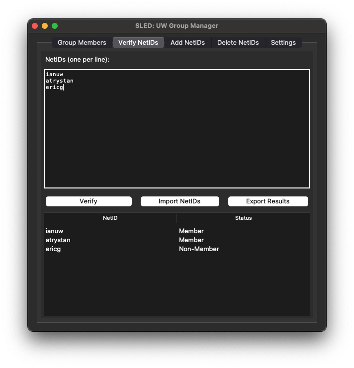

# SLED: UW Groups Web Service Interface 


This project is a Group/NetID Management Application developed using Python and Tkinter. The application is designed to streamline and accelerate batch NetID additions, deletions, and verifications to organizational groups via a REST API, significantly improving efficiency for group and NetID management tasks.



## Features

- **Batch NetID Additions/Deletions**: Add/Delete multiple NetIDs to organizational groups quickly and efficiently.
- **Batch NetID Group Verification**: Check group membership of a NetID.
- **Configurable Settings**: Easily configure the certificate and key file paths, group names, and API endpoints through a settings page.


## How to use

This application can be used in two ways: either by running the prebuilt `.app` or `.exe` file or by setting up a development environment. Follow the instructions below based on your preference.

### Option 1: Running the Prebuilt `.app` File

If you'd like to use the app without setting up a development environment, follow these steps:

1. **Download the `.app` file** from the provided release page.
2. Move the `.app` file to your Applications folder or any desired location.
3. **Double-click the `.app` file** to launch the application.

> **Note**: You will need to obtain a certificate and private key to connect to the UW Groups Web Service API. Follow the instructions below for obtaining and configuring these credentials.

### Option 2: Running in a Development Environment

If you'd like to work within a development environment, follow these instructions:

1. **Clone the repository** to your local machine:
   ```bash
   git clone https://github.com/iwangy/sled.git
   cd sled

2. **Setup a virtual environment (recommended)**
    ```python
    python3 -m venv venv
    source venv/bin/activate  
    # On Windows, use `venv\Scripts\activate`

3. **Install dependencies**
    ```python
    pip install -r requirements.txt

4. **Obtain the UW Groups Web Service API certificate and private key:**
- Follow UW API Documentation to request and download your certificate and private key files.
- Save these files securely on your machine.

5. **Run the application:**
    ```python
    python sled.py

6. **To package the installation into an .exe or .app**
    To create an app executable or application you must run the command below on the supported hardware. ie: .exe run on Windows, .app run on Mac

    ```python
    pyinstaller Sled.py --windowed -i "./images/sled.icns"
    
> Note: When running in a development environment, additional configurations or tweaks can be made to the code to suit specific needs or testing purposes.

## How to obtain credentials for GWS API

wip
